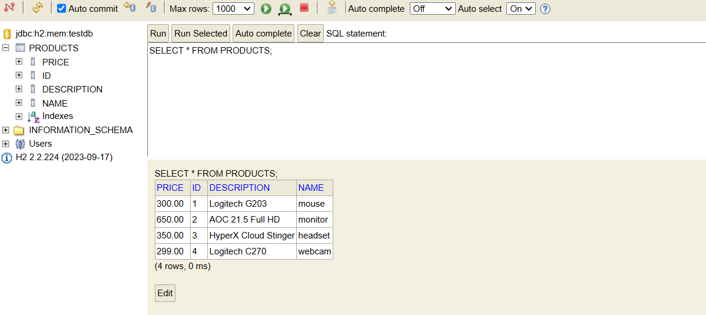

# E-commerce API

## Descrição

API para um e-commerce desenvolvida com Java e Spring Boot, seguindo boas práticas de desenvolvimento.

Tecnologias Utilizadas

- Java 17

- Spring Boot 3

- PostgreSQL

- Docker

- Lombok

- Maven

## Funcionalidades

 - Adicionar produtos

- Atualizar produtos

- Excluir produtos

- Listar todos os produtos

## Endpoints Principais

GET /produtos - Lista todos os produtos

POST /produtos - Cadastra um novo produto

PUT /produtos/{id} - Atualiza um produto existente

DELETE /produtos/{id} - Remove um produto
 
### Banco de dados H2

